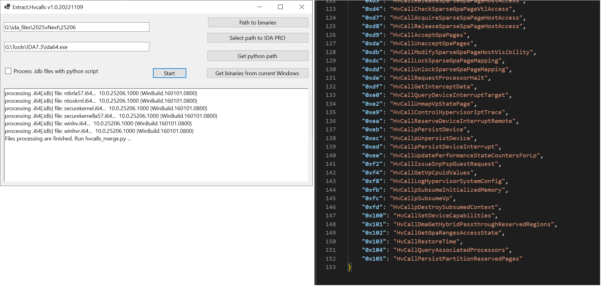

Mirror of https://github.com/gerhart01/Hyper-V-Tools/tree/main/Extract.Hvcalls for plugins.hex-rays.com site.

Extract.Hvcall (Hvcall GUI - GUI interface for extract_hvcalls.py IDA PRO script) utility for automatically extraction of Hyper-V hypercalls names and code numbers from Hyper-V core binaries:

	securekernel.exe
	winhvr.sys
	winhv.sys
	ntoskrnl.exe
	
additionally can be added
 
	securekernella57.exe
	ntkrla57.exe

Use IDA PRO for binary analysis. Install python plugins

```python
pip install:
 sark
 pefile
 pyqt5
``` 
 or
 
```python
 pip install -r requirements.txt
```

1. Run HvcallGUI.exe



2. Select path to Hyper-V core binaries and IDA PRO or modify config.json in program folder (preferably for multiple runnings)
3. Click 'Start' button 
4. Waiting, until IDA PRO had finished script processing
5. You can see resulting json files inside "result" directory:
	hvcalls_results.json - list of Hyper-V hypercalls
	hvcalls_unknown.json - list of hypercalls name with unknown Hypercall code number (you need to do manual analysis for it)
	
I recommend extract hypercalls from winhvr.sys and winhv.sys first, then from other files.  
If you have problems with extraction results try to prepare IDA PRO database manually and save it in i64 files as usual.

GPL3 License