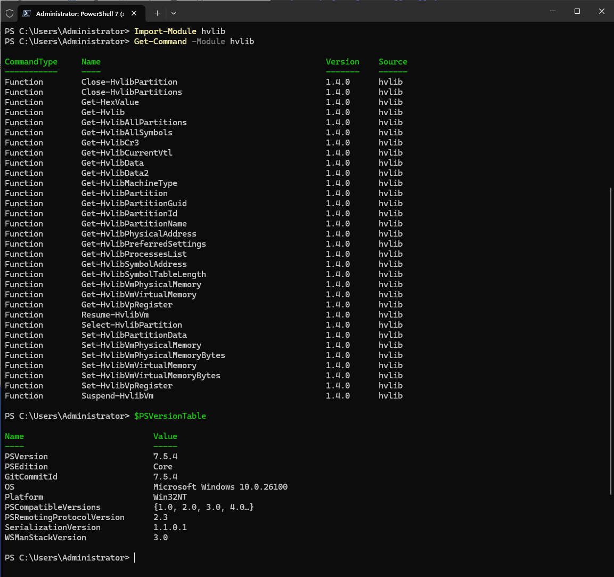

#
# Hyper-V Memory Manager module for Powershell
#

Installation instructions:

1. Copy files to C:\Program Files\WindowsPowerShell\Modules
2. Import module in Powershell console:
```
Import-Module -FullyQualifiedName @{ModuleName = 'Hvlib'; ModuleVersion = '1.0.0' }   
```
3. Execute cmdlets:



Also see Set-HvlibCloudExample.ps example for cmdlets usage.
 