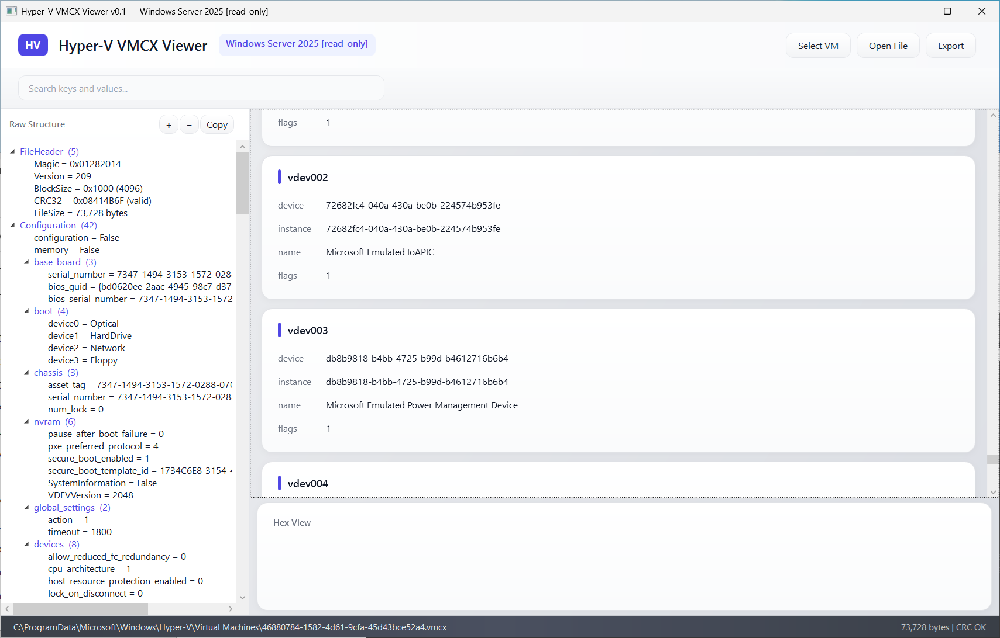

HyperV VMCX Viewer\Editor - tool for view or change Hyper-V Virtual Machine configuration VMCX files (early it was xml file, but from Windows Server 2016 it had converted to binary format).  
Be careful with VMCX changes (make backup copy before applying it) - tool is testing still.  

  