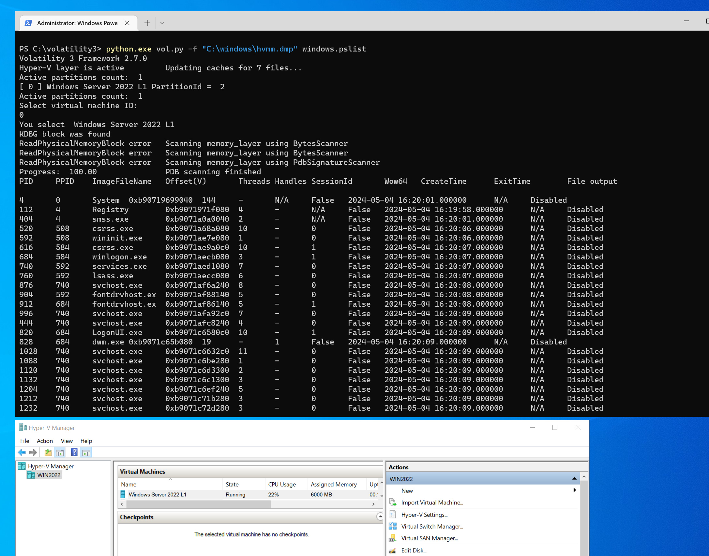

#
# Hyper-V Memory Manager plugin for volatility (https://github.com/volatilityfoundation)
#

Installation instructions:

1. Download volatility3 from [Github](https://github.com/volatilityfoundation/volatility3)   
2. Download [Hyper-V Memory Manager plugin for volatility](https://github.com/gerhart01/Hyper-V-Tools/releases/download/1.0.20221109/Hyper-V.Memory.Manager.plugin.for.volatility.v1.0.20221109.zip) (check latest release):

and get files for volatility integration:  

```
hyperv.py 
stacker.py 
```

3. Install modules for volatility 3

```
    pip install -r requirements.txt
```

4. Copy hyperv.py to volatility3\framework\layers  
5. Modify volatility3\framework\automagic\stacker.py - you can see example file stacker.py in plugin distributive 

5.1. Insert in import section next code 

```python
import os
from volatility3.framework.layers import hyperv  
```  

for volatility3 build 2.7.0 it looks like:

```python
import logging
import sys
import traceback
import os

from typing import List, Optional, Tuple, Type

from volatility3 import framework
from volatility3.framework import interfaces, constants
from volatility3.framework.automagic import construct_layers
from volatility3.framework.configuration import requirements
from volatility3.framework.layers import physical
from volatility3.framework.layers import hyperv
```

5.2. Find string

```python
        physical_layer = physical.FileLayer(
            new_context, current_config_path, current_layer_name
        )
```

replace it with next code:

```python
 #
 # hvlib integration
 #

 dir_win = os.getenv('WINDIR')
 dir_win = dir_win.replace('\\','/').lower()

 hvlib_fn = "file:///"+dir_win+"/hvmm.dmp"

 if location.lower() == hvlib_fn:
   print("Hyper-V layer is active")
   physical_layer = hyperv.FileLayer(
         new_context, current_config_path, current_layer_name
      )
 else:
   physical_layer = physical.FileLayer(
        new_context, current_config_path, current_layer_name
   )
 ```

6. Copy 
```
hvlib.py
hvlib.dll 
hvmm.sys 
```
to <python_dir>\Lib\site-packages (f.e. C:\Python312x64\Lib\site-packages).
	If you use some python virtual environment plugins, you need to copy files inside it.  
	For example to venv\Lib\site-packages for virtualenv.  
7. Create file C:\windows\hvmm.dmp. It can be empty (volatility have to read real file)  
8. Execute  

```
python.exe vol.py -vv -f "C:\windows\hvmm.dmp" windows.pslist
```

Often volatility is working bad with fresh Windows versions or old Windows versions with fresh updates. 
Take Windows 10 dump using LiveCloudKd and check it in volatility, if you see error messages when scanning Hyper-V VM. 
Also you can check Windows 7 dump for correct volatility working purpose, according project pages: https://github.com/volatilityfoundation/volatility/wiki/Memory-Samples ...
 

